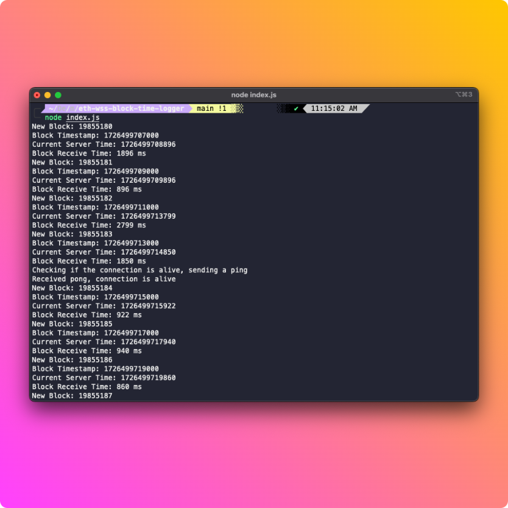

# Ethereum WebSocket Block Time Logger with Block Tracing

This Node.js script connects to an Ethereum WebSocket endpoint to monitor new blocks on the blockchain. It calculates and logs the time difference between when a block is received and its timestamp in milliseconds. Additionally, the script uses the `debug_traceBlockByNumber` method to trace block execution details for each new block, with an option to toggle this functionality. It also includes functionality to manage WebSocket connection stability and simulate connection issues for testing purposes.

## Features

- **WebSocket Connection Management**: Connects to an Ethereum node using WebSocket and handles connection stability with ping/pong mechanisms.
- **Block Time Logging**: Logs the time difference between the block's timestamp and the current server time in milliseconds.
- **Block Tracing**: Uses `debug_traceBlockByNumber` to trace block execution details and logs the results.
- **Reconnection Logic**: Automatically attempts to reconnect if the WebSocket connection is lost, with exponential backoff for retry delays.
- **Simulated Disconnection**: Optionally simulates a disconnection for testing purposes.

## Prerequisites

- Node.js (v16.x or later)
- Ethers.js library
- Access to an Ethereum node that supports `debug_traceBlockByNumber`

## Installation

1. **Clone the Repository**: If the code is hosted on a version control platform, clone the repository. If not, create a new file and paste the code into it.

2. **Install Dependencies**: Run the following command to install the required `ethers` library:
   `npm install ethers`

## Configuration

- **ETH_NODE_WSS**: Update the `ETH_NODE_WSS` in the `config` object with your Ethereum node WebSocket endpoint.
- **RPC_NODE_RPC**: Update the `RPC_NODE_RPC` with the HTTP RPC endpoint for a node that supports `debug_traceBlockByNumber`.

## Usage

1. **Save the Script**: Save the provided script to a file, for example, `block-time-logger.js`.

2. **Run the Script**: Execute the script using Node.js:
   `node index.js`

3. **View Logs**: The script logs information to the console, including:
- New block number
- Block timestamp (in milliseconds)
- Current server time (in milliseconds)
- Time difference between the block timestamp and the current server time (in milliseconds)
- Block trace result (if tracing is enabled)

## Configuration Options

- **simulateDisconnect**: Set this to `true` to enable simulated disconnections, which helps in testing reconnection logic. Set it to `false` to disable this feature.
- **enableTraceBlock**: Set this to `true` to enable tracing of block execution with `debug_traceBlockByNumber`. Set it to `false` to disable tracing and only log block times.

## Code Explanation

- **WebSocket Provider**: Uses `ethers.providers.WebSocketProvider` to establish a WebSocket connection with the Ethereum node.
- **Keep-Alive Mechanism**: Sends periodic ping messages and checks for pong responses to ensure the connection is alive.
- **Block Event**: Listens for new blocks and calculates the time difference between the block's timestamp and the current server time.
- **Block Tracing**: When a new block is received, it triggers a call to `debug_traceBlockByNumber` (if enabled) to trace the block's execution details and logs the results.
- **Reconnection**: Implements a reconnection strategy with exponential backoff if the connection is lost.

## Error Handling

The script includes error handling for:
- WebSocket connection errors
- Errors while fetching block data
- Errors when calling `debug_traceBlockByNumber`

## License

This project is licensed under the MIT License. See the `LICENSE` file for details.

## Contact

For questions or issues, please contact laurence@quiknode.io.